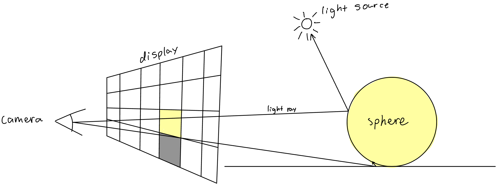
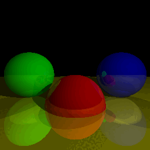

# Python Raytracer


## Description
This is a raytracer written in Python using [this book](https://gabrielgambetta.com/computer-graphics-from-scratch/) as a guide. This program is quite slow as it is only single threaded, runs on the CPU, and is written in Python. The user describes the scene in `better_raytracer.py`, which is then rendered. In its current state, the program will make the camera move backward a small amount each frame.

## How to Run
In `better_raytracer.py`, you can specify the parameters of the camera, objects, and other attributes of the scene. You can specify where the frames of the animation are put as well. By default, the program renders three reflective balls on a plane. The frames are saved to images/video1. To run the program, run
```
$ python3 better_raytracer.py
```

## Example
```
$ python3 better_raytracer.py
```
<br/>(gif created using ImageMagick: `convert *.png(n) showcase.gif`)